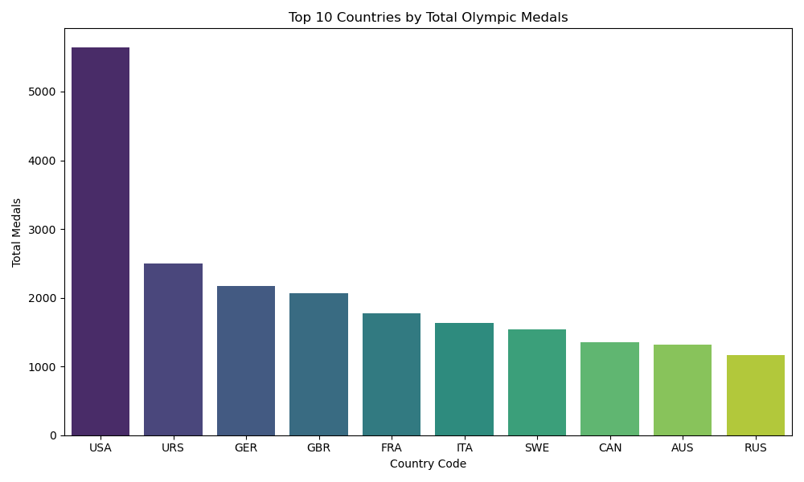
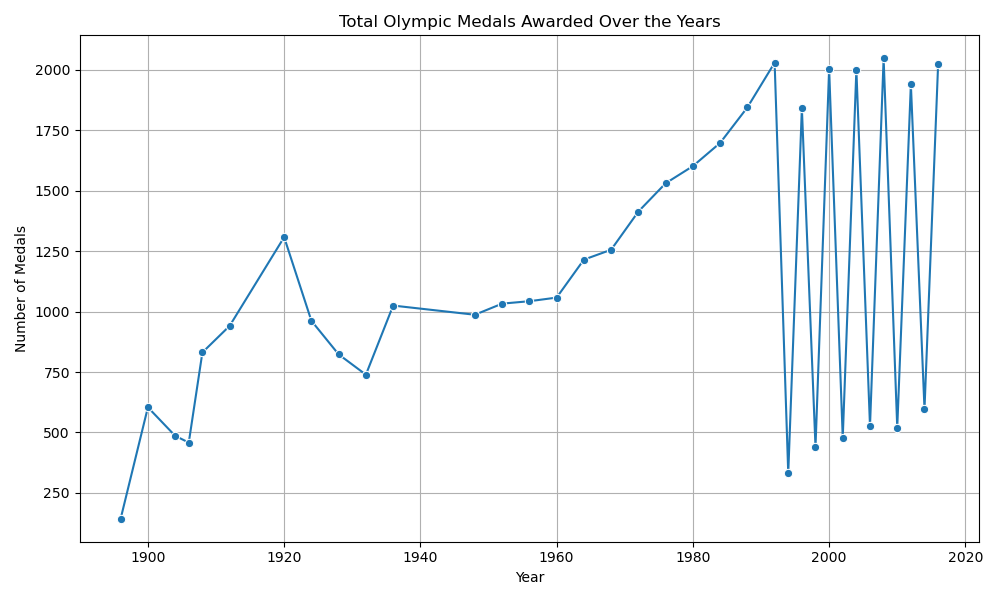

# 🏅 Olympic Medal Analysis using Python 🐍 & Jupyter 📓

Analyze Olympic medal trends by country, year, and sport using real-world data from the Olympics Kaggle dataset. Gain insights through clean visualizations and summaries.

*Top 10 Countries with Highest Medal Counts*

---

## 📁 Dataset
- `athlete_events.csv`: Olympic history of 120 years (1896–2016)
- `noc_regions.csv`: Maps NOC codes to countries/regions

## 📊 What This Project Covers
- Total medals won by country
- Year-wise medal trend
- Top-performing countries
- Sport-wise country dominance
- Medals per capita (optional idea)

---

## 🔍 Key Visualizations
- 📈 Line chart of medals over years  
  

- 🥇 Top 10 countries bar chart  
  

---

## 🧠 Technologies Used
- Python 3.x
- Jupyter Notebook
- Pandas, NumPy
- Matplotlib, Seaborn

---

## 🚀 How to Run
1. Clone the repo:
git clone https://github.com/Aditibhoir/olympic-medal-analysis.git
cd olympic-medal-analysis

2.Launch the notebook:
jupyter notebook olympic_analysis.ipynb  
